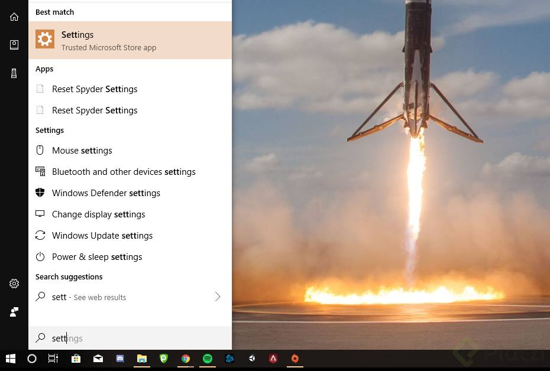
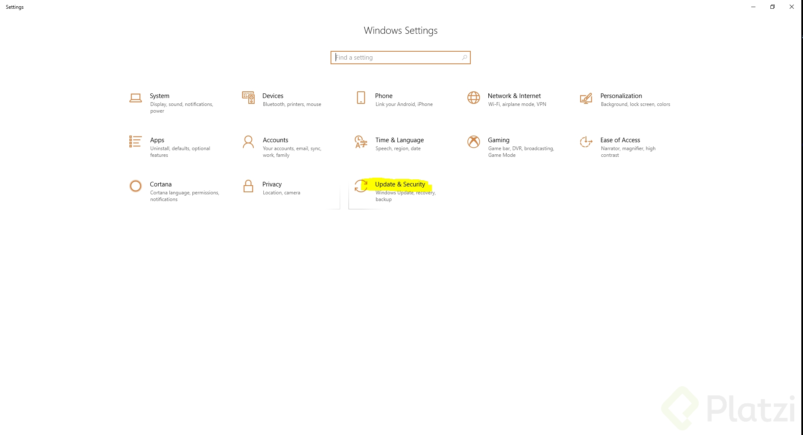
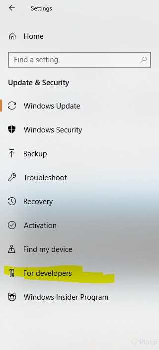
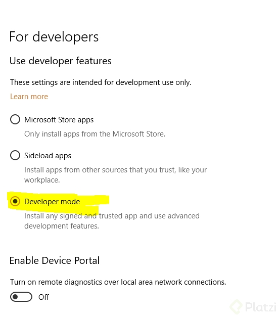
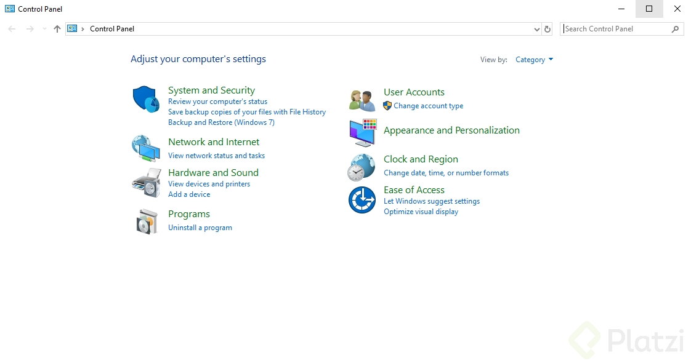
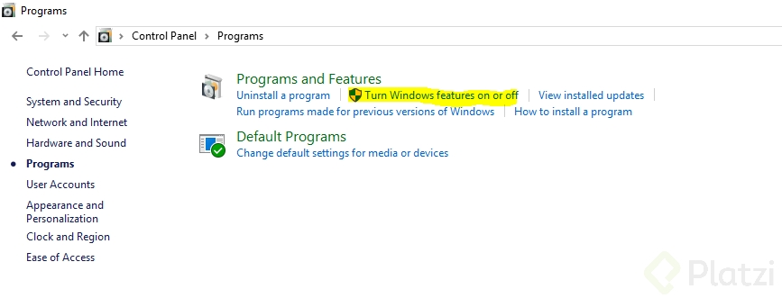
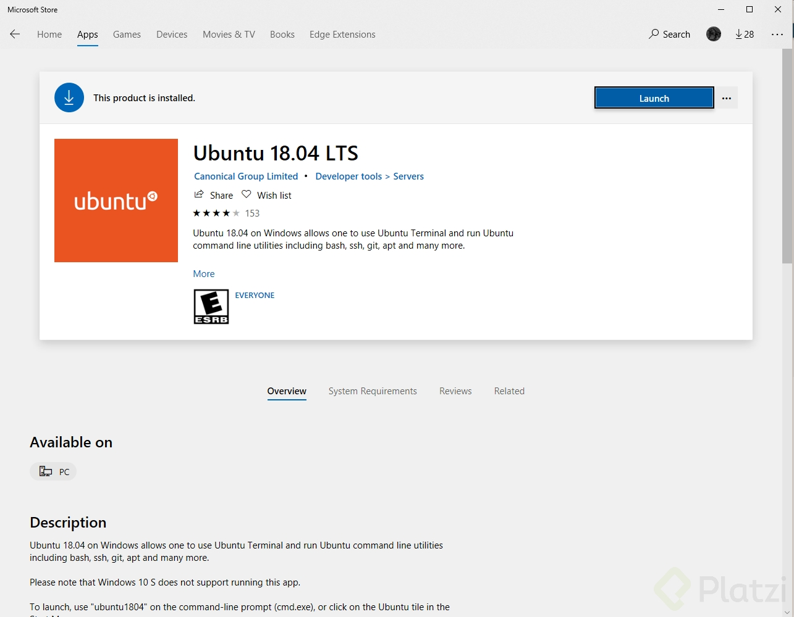
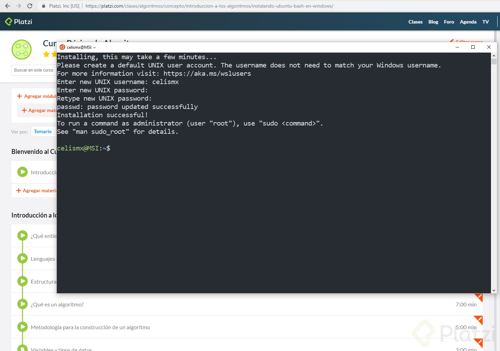

# Curso de Prework Platzi 💻

## Instalación de Ubuntu Bash en Windows 

En este tutorial configuraremos el Ubuntu dentro de tú Windows 10 para que puedas ejecutar tus códigos de C tal como lo hago en el curso.

Lo primero que necesitas es que tu computadora tenga instalado Windows 10 de 64 bits y tengas tu sistema operativo actualizado **(sobre todo con el “Windows 10 Anniversary Update”)**

**Una vez hayas verificado que tu computadora cumple con los requisitos entra a los settings del sistema (Ajustes)**



**Luego entra a la opción de Actualizaciones y Seguridad**



**En el menú de la izquierda has click en opciones para desarrolladores y habilita el “Modo Desarrollador”**



**Después, accede al panel de control y haz click en “Programas”**



**Una vez ahí, haz click en activar o desactivar características de windows**



**Aquí, busca la opción de “Windows Subsystem for Linux” y actívala, instala eso y permite que tu computadora se reinicie.
Luego, entra al menú inicio, escribe bash y sigue los pasos que te indique, en caso de que te diga que no tienes ninguna distribución sólo ve a la tienda de aplicaciones y descargaba Ubuntu para Windows.**



**Luego, ejecuta Ubuntu, crea tu usuario y contraseña y estás lista o listo para continuar.**





## Configuración de ZSH para Windows con Linux Shell

- https://docs.microsoft.com/en-us/windows/wsl/install-win10
- https://hyper.is/

**Personalizar ZSH:**
- https://www.freecodecamp.org/news/jazz-up-your-zsh-terminal-in-seven-steps-a-visual-guide-e81a8fd59a38/

## Comando para actualizar o instalar NPM y NodeJS
```
curl -sL https://deb.nodesource.com/setup_12.x | sudo -E bash -

sudo apt-get install -y nodejs 
```

## Instalación y configuración de VSCode 

Si la primera mejor amiga del programador es la línea de comandos, es momento de instalar y configurar el segundo mejor amigo del programador: **el editor de código.**

Existen multiples editores de código, para la escuela de JavaScript vamos a utilizar **Visual Studio Code.** Vamos a añadir diferentes plugins para VSCode: 

- Git Blame: va a mostrar el autor de la línea de código en la que estemos trabajando. 

- ESLint: es una herramienta de análisis de código estático para identificar patrones problemáticos encontrados en el código JavaScript, o sea, nuestro linter. Debemos instalar y configurar eslint para que siga el estilo de código que le indiquemos.

**Instalación y configuración de ESLint**
1. Instalar ESLint en VSCode
2. Instalar ESLint globalmente desde la terminal:

```
npm install -g eslint
```

3. Inicializar la configuración de ESLint en nuestro proyecto
```
npx eslint --init
```

4. Elegir las configuraciones recomendadas
 - To check syntax, find problems, and enforce code style
 - JavaScript modules (import/export)
 - React (O el framework que trabajes en el proyecto)
 - Browser
 - Use a popular style guide (AirBNB)
 - JSON

- Color Highlight: resalta el color que estemos escribiendo. 

- SASS: es un preprocesador de CSS. 

- Remote - WSL
 

**Herramientas para Chrome de Desarrollo FrontEnd:**
- React Developers Tools
- Redux DevTools

**Herramientas para Chrome de Desarrollo BackEnd:**
- JSON Viewer
- Postman)

## Código para solucionar error en cónsola ELIFECYCLE

```
$ sudo npm cache clean --force

$ sudo rm -rf node_modules  

$ sudo npm install -g

$ npm start
```
